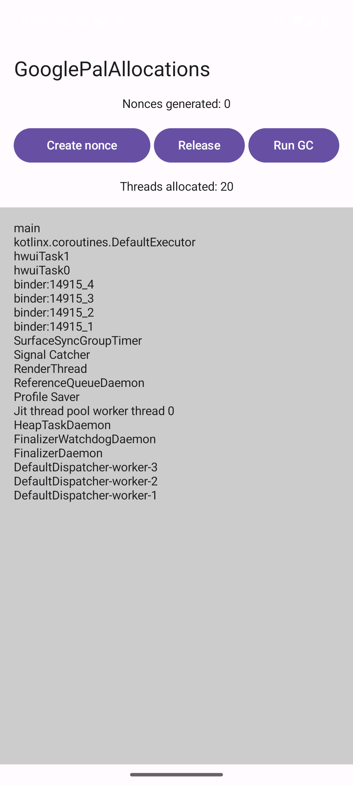
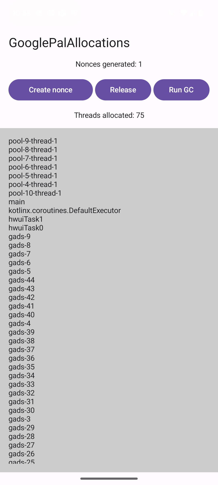

# Google PAL Allocations

Project to showcase the thread allocations of the PAL Sdk for Android: https://developers.google.com/ad-manager/pal/android

## Issues

1. When creating `NonceLoader`, the library allocates around 34 threads with `gads-` as prefix for their names. You can see this by clicking on `Create nonce`
in this sample project app and observe the list of threads.
2. When generating a new nonce with `Create nonce` button, the `NonceLoader` allocates again one new thread per nonce request.

## Comparison

Before creating `NonceLoader`:

After generating the first nonce:

